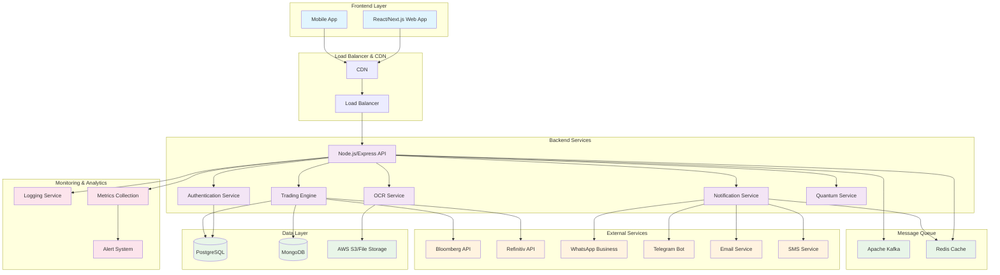
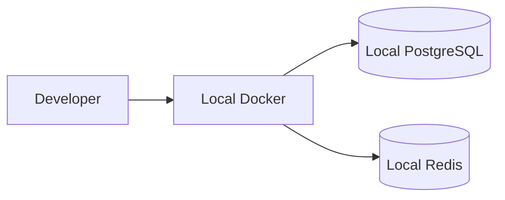
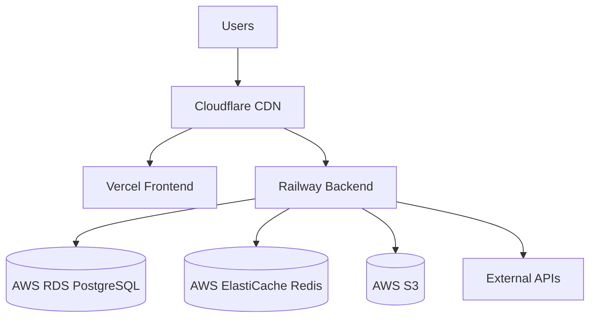

# QuantEnergx Architecture

## Overview

QuantEnergx is a comprehensive energy trading platform built with modern web technologies. The system follows a microservices architecture pattern with clear separation between frontend, backend, and data services.

## System Architecture

## Core Components

### Frontend Layer
- **React/Next.js Web Application**: Main user interface for web users
- **Mobile Application**: React Native or PWA for mobile access
- **CDN & Load Balancer**: Content delivery and traffic distribution

### Backend Services
- **API Gateway**: Central entry point for all API requests
- **Authentication Service**: JWT-based authentication and authorization
- **Trading Engine**: Core trading logic and market data processing
- **Notification Service**: Multi-channel communication (WhatsApp, Telegram, Email, SMS)
- **OCR Service**: Document processing and text extraction
- **Quantum Service**: Advanced analytics and quantum computing integration

### Data Layer
- **PostgreSQL**: Primary relational database for transactional data
- **MongoDB**: Document storage for unstructured data
- **Redis**: Caching and session storage
- **Apache Kafka**: Event streaming and message queuing
- **File Storage**: AWS S3 or compatible object storage

### External Integrations
- **Market Data Providers**: Bloomberg, Refinitiv, ICE, NYMEX
- **Communication**: WhatsApp Business API, Telegram Bot API
- **Notifications**: Email (SendGrid), SMS (Twilio)

## Security Architecture

### Authentication & Authorization
- JWT tokens with refresh token rotation
- Role-based access control (RBAC)
- API key management for external integrations
- Multi-factor authentication support

### Data Protection
- Encryption at rest and in transit
- Environment-based configuration management
- Secure secret storage and rotation
- Input validation and sanitization

### Network Security
- HTTPS/TLS encryption
- CORS configuration
- Rate limiting and DDoS protection
- Security headers and CSP

## Deployment Architecture

### Development Environment

### Production Environment

## Technology Stack

### Frontend
- **Framework**: React 18 with Next.js 13+
- **Language**: TypeScript
- **Styling**: Material-UI, Tailwind CSS
- **State Management**: Redux Toolkit
- **Testing**: Jest, React Testing Library, Cypress
- **Build Tools**: Webpack, SWC

### Backend
- **Runtime**: Node.js 20+
- **Framework**: Express.js
- **Language**: TypeScript
- **Testing**: Jest, Supertest
- **Documentation**: OpenAPI/Swagger
- **Process Manager**: PM2

### Data & Infrastructure
- **Database**: PostgreSQL 15+, MongoDB
- **Cache**: Redis 7+
- **Message Queue**: Apache Kafka
- **Container**: Docker, Docker Compose
- **Orchestration**: Kubernetes (production)
- **Monitoring**: Prometheus, Grafana

### DevOps & CI/CD
- **Version Control**: Git, GitHub
- **CI/CD**: GitHub Actions
- **Deployment**: Railway, Vercel, AWS
- **Monitoring**: New Relic, Sentry
- **Security**: Snyk, CodeQL

## Data Flow

### Trading Data Flow
1. Market data received from external providers
2. Data processed and validated by Trading Engine
3. Stored in PostgreSQL for transactional data
4. Cached in Redis for fast access
5. Events published to Kafka for downstream processing
6. Frontend receives real-time updates via WebSocket

### Notification Flow
1. Trading events trigger notification requirements
2. Notification Service determines recipients and channels
3. Messages queued in Kafka for reliable delivery
4. Multi-channel delivery (WhatsApp, Telegram, Email, SMS)
5. Delivery status tracked and retries handled

## Scalability Considerations

### Horizontal Scaling
- Stateless API services for easy scaling
- Database read replicas for query distribution
- Redis clustering for cache scaling
- Kafka partitioning for message throughput

### Performance Optimization
- CDN for static asset delivery
- Database indexing and query optimization
- Caching strategies at multiple levels
- Asynchronous processing for heavy operations

### Reliability
- Health checks and auto-recovery
- Circuit breakers for external service calls
- Database backup and point-in-time recovery
- Multi-region deployment for disaster recovery

## Development Guidelines

### Code Organization
- Domain-driven design principles
- Clear separation of concerns
- Dependency injection for testability
- Interface-based abstractions

### API Design
- RESTful API design principles
- Consistent error handling
- API versioning strategy
- Comprehensive documentation

### Testing Strategy
- Unit tests for business logic
- Integration tests for API endpoints
- End-to-end tests for critical flows
- Performance testing for key scenarios

## Future Considerations

### Quantum Computing Integration
- Quantum algorithms for portfolio optimization
- Risk analysis and prediction models
- Advanced pattern recognition

### AI/ML Integration
- Predictive analytics for trading decisions
- Natural language processing for market sentiment
- Automated trading strategy optimization

### Blockchain Integration
- Smart contracts for automated trading
- Decentralized data verification
- Cryptocurrency trading support